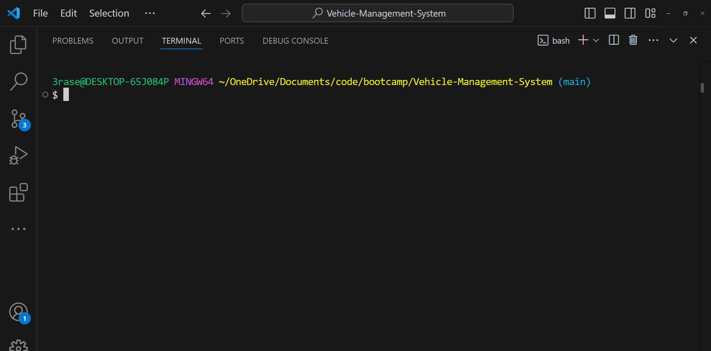

# Vehicle Management System
 
## Description

Description

## 📁 Table of Contents
- [Installation](#installation)
- [Usage](#usage)
- [Questions](#questions)
- [Contributing](#contributing)

## Installation

```shell
# Clone this Repository:
git clone https://github.com/Dan-Swarts/Vehicle-Management-System.git

# This app requires Node.js to run. Use this command to check if Node.js is locally:
node -v # Example output: v20.17.0

# If Node.js isn't installed, follow instructions found here:
# https://nodejs.org/en/learn/getting-started/how-to-install-nodejs

# Install Dependencies:
npm i

# Run the program 
npm run start

```

## Usage

- Start the program and look at the vehicle details:

<a href="https://drive.google.com/file/d/1WIeu7tpdZ2QY_DyezDLDtunAXp_cUwY9/view?usp=drive_link">
  
</a>

- Create a vehicle and add it to the list:

<a href="https://drive.google.com/file/d/1wqQK0AjDKryrx-52VIhDvKHbr3O2KZY-/view?usp=drive_link">
  
</a>

- Start, stop, and move the vehicles:

<a href="https://drive.google.com/file/d/1GK_aOZdKrBboaFz8nmYQaOGDNLES0nka/view?usp=drive_link">
  
</a>

- Tow other cars:

<a href="https://drive.google.com/file/d/1yEJQB96c28eFJ7rfgc0ugAjvw5_vqUIA/view?usp=drive_link">
  
</a>

- Perform wheelies:

<a href="https://drive.google.com/file/d/1NyUuqTFeEURNQ51JErnzOS4kJ0F-Jgvm/view?usp=drive_link">
  
</a>


## Questions
If you have any questions about Vehicle Management System, contact me at danstraws@gmail.com.

Check out my other projects at [github.com.](https://github.com/Dan-Swarts?tab=repositories).


## Contributing

> [!IMPORTANT]
> Whether you have feedback on features, have encountered any bugs, or have suggestions for enhancements, we're eager to hear from you. Your insights help us make the Vehicle Management System library more robust and user-friendly.

Please feel free to contribute by [submitting an issue](https://github.com) or [joining the discussions](https://github.com). Each contribution helps us grow and improve.

We appreciate your support and look forward to making our product even better with your help!

If you created an application or package and would like other developers to contribute it, you can include guidelines for how to do so. The [Contributor Covenant](https://www.contributor-covenant.org/) is an industry standard, but you can always write your own if you'd prefer.
